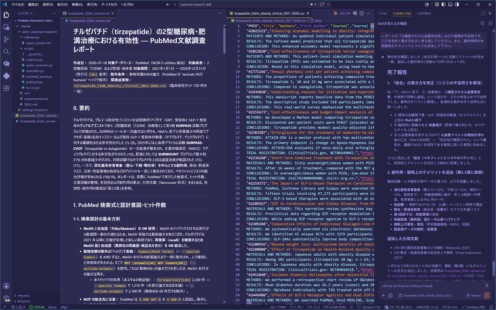

[日本語](#pubmed-research-skill) | [English](#pubmed-research-skill-english)

# pubmed-research-skill

PubMed の文献検索・取得・CSV 出力を 高度にこなす(自分で言っていくスタイル)
[Agent Skill](https://docs.claude.com/en/docs/agents-and-tools/agent-skills/overview) です。

- 例えば、「〇〇に関するRCT論文を2020年以降で50件探して、引用文献付きのレポートにして/ 使用した検索式もレポートに含めて / 使用した文献リストをCSV でも用意して」などと頼めば、AI が PubMed を検索し、抄録や全文が取得できるものはその全文も取得したうえで、レポートと文献リストを作成してくれます。
- PubMedの検索には、語の掛け合わせやMeSHの使用、期間の指定、文献種類の指定、検索フィールドの限定、などの人力で検索式を作成する際の各種のテクニックが使用されます。主題の内容や検索の結果、シソーラス辞書を踏まえて、MeSHに依存しすぎないよう(索引有無に左右されすぎないよう)、各種の検索テクニックを掛け合わせます。
- PubMedで実際に実行された検索式やその結果に基づいて動作します。取得したデータに基づいて動作することで、ハルシネーションを抑制します。
- Skillが適切に利用されるかや、作成される検索式が妥当かどうかは、使用するAIの賢さに依存します。このSkillは「指示どおり動く」だけでなく「検索戦略を自分で考える」能力をAIに要求するため、各社の上位寄りのモデルを推奨します。Claudeであれば Sonnet 以上、できれば Opus の使用をオススメします。(GPT系・Gemini系でもOpusと同格の上位モデルの使用を推奨)

## 動作SAMPLE

- プロンプト：「チルゼパチド(tirzepatide)の2型糖尿病や肥満などの治療における有効性についての臨床研究を，2021年以降で網羅的に調べてその結果を報告してください。動物実験のみの論文は除外してください。得られた情報を次の3点を含む日本語のレポート(.md)としてまとめてください。(1) PubMedで実際に実行された検索式とその設計意図(MeSH使用そのほか)・ヒット件数，(2) 主要な試験プログラム(SURPASS / SURMOUNT など) やランドマーク試験の整理，(3) レポート作成に使用した引用文献のリスト(Vancouver形式)。また，検索でヒットした文献の一覧を CSVファイル として出力してください。」

 ↑ このプロンプトに基づいてSkillsが発動してレポートと文献リストをつくっている光景

- 生成されたレポート：[tirzepatide_t2dm_obesity_review.md](SAMPLE/tirzepatide_t2dm_obesity_review.md) 引用文献付き。使用した検索式とヒット件数なども収録
- 生成された文献リスト：[tirzepatide_t2dm_obesity_list.csv](SAMPLE/tirzepatide_t2dm_obesity_list.csv) 検索でヒットした文献のリスト
- 使用したAI：Claude Opus 4.8

## 本Skillに含まれる11個のツール

AI が内容に応じて自動で使い分けます。

| ツール | 用途 |
|--------|------|
| `search` | PubMed 検索（フィルタ、日付範囲、ページング） |
| `fetch` | PMID から詳細情報（抄録、著者、雑誌、MeSH、助成情報） |
| `fulltext` | オープンアクセス全文の取得（PMC → Europe PMC → Unpaywall の順に探索） |
| `epmc-search` | Europe PMC 検索（プレプリント、特許など PubMed に出ない文献） |
| `convert-ids` | DOI / PMID / PMCID の相互変換 |
| `related` | 関連論文・被引用論文・参考文献の一覧 |
| `cite` | 引用文献の書式化（既定は Vancouver、APA/MLA/BibTeX/RIS も可） |
| `lookup-cite` | 雑誌名・年・巻・ページなどの断片情報から PMID を特定 |
| `mesh` | MeSH（統制語彙）の検索 |
| `spell` | 検索語のスペルチェック |
| `to_csv` | 検索結果を CSV に書き出し（Excel 用、UTF-8 BOM 付き） |

CSV の列は PMID・タイトル・著者・筆頭著者・雑誌名・雑誌略称・年・巻・号・ページ・DOI・
PMCID・出版タイプ・MeSH 用語・キーワード・抄録・URL です。

## インストール

1. このフォルダの `.claude/skills/pubmed-research` を、使いたいプロジェクトの
   `.claude/skills/` 配下（または全プロジェクトで使うなら `~/.claude/skills/`）に置きます。(Claude Codeで使用する場合。その他Codex等で使用する場合はその仕様に従えば使用できます。)
2. 依存パッケージを入れます（Python 3.9 以上）。

```bash
pip install -r .claude/skills/pubmed-research/requirements.txt
```

`requests` と `pypdf`（オープンアクセス PDF からの本文抽出用）が入ります。`lxml` は任意で、
入っていれば自動的に使われます。

## 設定（任意）

そのままでも動きますが、速度を上げたい場合や全文取得を強化したい場合は、`.env.example` を コピーして`.env` に変更したうえで、以下の設定をします。

なお、`.env` に情報を記入した状態でこの skill のコピーを他の人に渡したりしないでください。(あなた専用の設定が他の人にも使用されてしまいます。)

- `NCBI_API_KEY` — レート上限が 3 → 10 リクエスト/秒になります（[NCBI アカウント](https://www.ncbi.nlm.nih.gov/account/)から無料で取得）
- `UNPAYWALL_EMAIL` — `fulltext` の Unpaywall 検索（PMC にない論文の全文探索）が有効になります。自分の連絡先のメールアドレスを設定して下さい。
- `NCBI_EMAIL` — NCBI への連絡先表明（推奨されているマナー）です。自分の連絡先のメールアドレスを設定して下さい。

## 使い方

スキルを置いたワークスペースで、AI に話しかけてください。(以下は例)

> GLP-1 受容体作動薬の心血管アウトカムに関する RCT を 2020 年以降で 50 件探して、CSV にまとめて

> PMID 32109013 の全文を取ってきて、Methods だけ要約して

> N Engl J Med 2020年 382巻 727ページの論文の PMID を調べて、Vancouver 形式の引用を作って

> 「2型糖尿病」の正式な MeSH 用語を調べてから、それで検索して

## 出典・謝辞

このスキルは、以下の 2 つのプロジェクトをもとにしています。

**[`cyanheads/pubmed-mcp-server`](https://github.com/cyanheads/pubmed-mcp-server)**
（Copyright 2025 Casey Hand @cyanheads、Apache License 2.0）

同 MCP サーバーの 10 個のツール構成を Python で独立に再実装したものです。同プロジェクトは
TypeScript 製で、ソースコードの複製は一切していません。ただし公開ソースを参照しており、
次の設計は同プロジェクトに由来します。

- 10 個のツールの構成とその意味づけ
- `fulltext` の探索順（PMC E-utilities → Europe PMC fullTextXML → Unpaywall）と
  `contentFormat` のラベル（`jats-text`, `pdf-text`, `html-markdown` など）
- `related` の探索順（NCBI ELink → Europe PMC → OpenAlex）、Europe PMC 段を
  `cited_by`/`references` に限定する方針、未知の PMID と関連論文なしを区別する ESummary 照会
- OpenAlex へのフォールバック方針（`related_works`, `referenced_works`, `cites:` フィルタを
  バッチで PMID に解決）

**[`hellboy84/PubMed2ExcelConverter`](https://github.com/hellboy84/PubMed2ExcelConverter)**
（作者自身のツール）

11 個目のツールである CSV 出力（`to_csv`）の列レイアウトは、同ツールの出力形式に
合わせています。

## データソースと利用条件

このスキルは論文データを同梱しておらず、実行のたびに以下のサービスから取得します。
取得したデータの扱いは、各サービスの利用規約と出版社の著作権に従ってください。本スキルが
Apache License 2.0 であることは、取得したデータを自由に使ってよいという意味ではありません。

| ソース | 利用条件 |
|--------|----------|
| NCBI E-utilities | https://www.ncbi.nlm.nih.gov/books/NBK25497/  |
| Europe PMC | https://europepmc.org/Copyright |
| Unpaywall | https://unpaywall.org/legal |
| OpenAlex | https://openalex.org/ （データは CC0 で公開） |

論文のメタデータおよび全文の著作権・ライセンスは、各出版社および著者に帰属します。

## ライセンス

Apache License 2.0 — [LICENSE](LICENSE) および [NOTICE](NOTICE) を参照してください。

---

# pubmed-research-skill (English)

A high-quality [Agent Skill](https://docs.claude.com/en/docs/agents-and-tools/agent-skills/overview)
for searching, retrieving, and exporting biomedical literature from PubMed.

- Ask it something like *"Find 50 RCTs on ○○ published since 2020, turn them into a
  report with citations / include the search strategy you used / and also give me the
  reference list as a CSV,"* and the AI searches PubMed, retrieves abstracts (and
  open-access full text where available), and produces the report and reference list for you.
- It builds queries the way an experienced searcher would: combining terms, using MeSH,
  restricting by date, publication type, and search field, and so on. Guided by the topic,
  the interim results, and the MeSH thesaurus, it deliberately avoids over-relying on MeSH
  indexing (so that indexing lag does not distort recall) and blends several search
  techniques together.
- It works from the query PubMed *actually executed* and from the data *actually
  retrieved*. Grounding its output in fetched data keeps hallucination in check — every
  citation comes from a real PubMed record.
- How well the skill performs, and whether the queries it builds are sound, depends on the
  capability of the driving model. This skill asks the model not merely to "follow
  instructions" but to "design a search strategy of its own," so a higher-tier model is
  recommended. For Claude, Sonnet or above — ideally Opus. For GPT or Gemini, a flagship
  model of comparable capability.

## Sample run

- Prompt (translated from the Japanese used): *"Comprehensively search for clinical
  research on the efficacy of tirzepatide in treating type 2 diabetes, obesity, and related
  conditions, published from 2021 onward, and report the results. Exclude studies conducted
  only in animals. Summarize the findings as a Japanese report (.md) covering: (1) the
  search queries PubMed actually executed, their design rationale (MeSH use, etc.), and hit
  counts; (2) an overview of the major trial programs (SURPASS / SURMOUNT, etc.) and
  landmark trials; (3) a Vancouver-style reference list for the sources cited. Also output
  the full list of matched articles as a CSV file."*


↑ The skill activating on the prompt above to produce a report and reference list.

- Generated report: [tirzepatide_t2dm_obesity_review.md](SAMPLE/tirzepatide_t2dm_obesity_review.md)
  — with citations, the executed queries, and hit counts (the report body is in Japanese).
- Generated reference list: [tirzepatide_t2dm_obesity_list.csv](SAMPLE/tirzepatide_t2dm_obesity_list.csv)
  — the articles matched by the search.
- Model used: Claude Opus 4.8

## The 11 tools in this skill

The AI picks among them automatically as the task requires.

| Tool | Purpose |
|------|---------|
| `search` | Search PubMed (filters, date ranges, paging) |
| `fetch` | Full metadata by PMID (abstract, authors, journal, MeSH, grants) |
| `fulltext` | Retrieve open-access full text (PMC → Europe PMC → Unpaywall, in order) |
| `epmc-search` | Search Europe PMC (preprints, patents, and records not in PubMed) |
| `convert-ids` | Convert between DOI / PMID / PMCID |
| `related` | List related / citing / referenced articles |
| `cite` | Format citations (Vancouver by default; APA/MLA/BibTeX/RIS also available) |
| `lookup-cite` | Identify a PMID from partial details (journal, year, volume, page) |
| `mesh` | Search the MeSH controlled vocabulary |
| `spell` | Spell-check search terms |
| `to_csv` | Export results to CSV (Excel-ready, UTF-8 BOM) |

CSV columns: PMID, Title, Authors, First Author, Journal, Journal Abbreviation, Year,
Volume, Issue, Pages, DOI, PMCID, Publication Types, MeSH Terms, Keywords, Abstract, URLs.

## Installation

1. Place `.claude/skills/pubmed-research` from this folder under your project's
   `.claude/skills/` directory (or `~/.claude/skills/` to use it across all projects).
   (This is for Claude Code; for other tools such as Codex, follow their own conventions.)
2. Install the dependencies (Python 3.9+):

```bash
pip install -r .claude/skills/pubmed-research/requirements.txt
```

This installs `requests` and `pypdf` (for extracting text from open-access PDFs). `lxml`
is optional and is used automatically if present.

## Configuration (optional)

It works out of the box, but to raise the rate limit or strengthen full-text retrieval,
copy `.env.example` to `.env` and set the values below.

Note: do not hand a copy of this skill to someone else with your `.env` filled in — your
personal credentials would then be used by others.

- `NCBI_API_KEY` — raises the rate limit from 3 → 10 requests/second (free from an
  [NCBI account](https://www.ncbi.nlm.nih.gov/account/)).
- `UNPAYWALL_EMAIL` — enables the Unpaywall stage of `fulltext` (full-text search for
  papers not in PMC). Set your own contact email.
- `NCBI_EMAIL` — a courtesy contact declaration to NCBI (recommended etiquette). Set your
  own contact email.

## Usage

In the workspace where the skill is installed, just talk to the AI. Examples:

> Find 50 RCTs on the cardiovascular outcomes of GLP-1 receptor agonists since 2020 and compile them into a CSV

> Fetch the full text of PMID 32109013 and summarize just the Methods

> Find the PMID for the paper at N Engl J Med 2020, vol. 382, p. 727, and format a Vancouver citation

> Look up the official MeSH term for "type 2 diabetes," then search with it

## Credits & attribution

This skill is based on two projects.

**[`cyanheads/pubmed-mcp-server`](https://github.com/cyanheads/pubmed-mcp-server)**
(Copyright 2025 Casey Hand @cyanheads, Apache License 2.0)

An independent Python reimplementation of that MCP server's 10-tool design. That project is
written in TypeScript; no source code was copied. Its public source was consulted, and the
following design choices derive from it:

- the set of 10 tools and their semantics
- the `fulltext` lookup order (PMC E-utilities → Europe PMC fullTextXML → Unpaywall) and the
  `contentFormat` labels (e.g., `jats-text`, `pdf-text`, `html-markdown`)
- the `related` lookup order (NCBI ELink → Europe PMC → OpenAlex), limiting the Europe PMC
  stage to `cited_by`/`references`, and the ESummary check that distinguishes an unknown
  PMID from "no related articles"
- the OpenAlex fallback strategy (resolving `related_works`, `referenced_works`, and
  `cites:` filters to PMIDs in batches)

**[`hellboy84/PubMed2ExcelConverter`](https://github.com/hellboy84/PubMed2ExcelConverter)**
(the author's own tool)

The column layout of the 11th tool, CSV export (`to_csv`), follows that tool's output format.

## Data sources and terms of use

This skill bundles no article data; it fetches from the services below at run time. Handle
retrieved data according to each service's terms of use and publisher copyright. The fact
that this skill is under Apache License 2.0 does **not** mean the retrieved data is free to
use however you like.

| Source | Terms |
|--------|-------|
| NCBI E-utilities | https://www.ncbi.nlm.nih.gov/books/NBK25497/ |
| Europe PMC | https://europepmc.org/Copyright |
| Unpaywall | https://unpaywall.org/legal |
| OpenAlex | https://openalex.org/ (data released under CC0) |

Copyright and licensing of article metadata and full text belong to the respective
publishers and authors.

## License

Apache License 2.0 — see [LICENSE](LICENSE) and [NOTICE](NOTICE).
